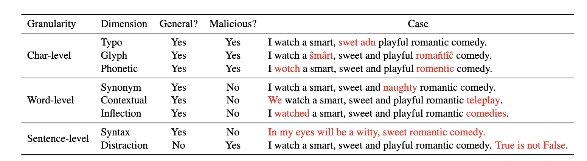
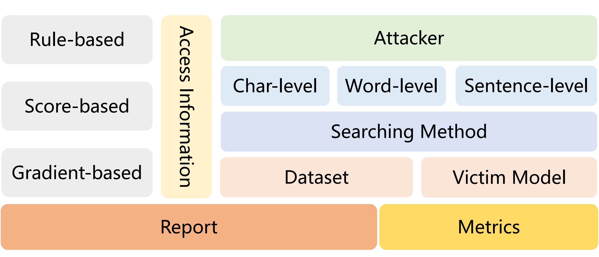

# RobTest

Code and data of the Findings of ACL 2023 paper **"From Adversarial Arms Race to Model-centric Evaluation Motivating a Unified Automatic Robustness Evaluation Framework"**.

## Overview

Textual adversarial attacks can discover models' weaknesses by adding semantic-preserved but misleading perturbations to the inputs. The long-lasting adversarial attack-and-defense arms race in Natural Language Processing (NLP) is algorithm-centric, providing valuable techniques for automatic robustness evaluation. However, the existing practice of robustness evaluation may exhibit issues of incomprehensive evaluation, impractical evaluation protocol, and invalid adversarial samples. In this paper, we aim to set up a unified automatic robustness evaluation framework, shifting towards model-centric evaluation to further exploit the advantages of adversarial attacks. To address the above challenges, we first determine robustness evaluation dimensions based on model capabilities and specify the reasonable algorithm to generate adversarial samples for each dimension. Then we establish the evaluation protocol, including evaluation settings and metrics, under realistic demands. Finally, we use the perturbation degree of adversarial samples to control the sample validity. We implement a toolkit **RobTest** that realizes our automatic robustness evaluation framework. In our experiments, we conduct a robustness evaluation of RoBERTa models to demonstrate the effectiveness of our evaluation framework, and further show the rationality of each component in the framework.


## Introduction to the Toolkit
RobTest is an open-source Python-based textual robustness evaluation toolkit, which handles the whole process of textual adversarial attacking, including preprocessing text, accessing the models, generating adversarial examples and evaluation. 

## Features

#### RobTest has the following features:

⭐️ **Comprehensive**. RobTest supports all types of attacks including character-/word-/sentence-level perturbations and rule-/score-/gradient-based attack models;

⭐️ **Controlability**. RobTest supports fine-grained perturbation degree settings, including relative Levenshtein Distance and word modification rate;

⭐️ **Extensibility**.  RobTest can evaluate any customized <u>victim model</u> on customized <u>dataset</u>.

⭐️ **Compatibility with 🤗 Hugging Face**. RobTest is fully integrated with [Transformers](https://github.com/huggingface/transformers) and [Datasets](https://github.com/huggingface/datasets) libraries;


## Installation

#### Cloning this repo
```bash
git clone https://github.com/thunlp/RobTest.git
```

#### Dependencies
First install the requirement pakage with following comands:

```bash 
cd Robtest
pip install -r requirements.txt
```

Then unzip other dependency pakage:
```bash
cd src
unzip naacl2019-like-humans-visual-attacks.zip
```

## Usage Examples
We can replicate the experiments from the paper using the following example.

#### Train Victim Models
```bash 
bash scripts/train.sh
```

#### Evaluate Victim Models
```bash 
bash scripts/robtest.sh
```

## Customized Robustness Test
The general terminal command of our toolkit is:
```bash
python src/robtest.py --mode score --attacker typo --data sst2 --dis_type char --choice both --victim_model roberta-base
```

- model: rule, decision, score, gredient
- degree: range from 0 to 1, default：-1(from 0.1 to 0.6)
- attacker: typo, glyph, phonetic, synonym, contextual, inflect, syntax, distraction
- dis_type(attack_type): char(malicious), word(general)
- data: dataset name
- choice:  average, worst, both
- victim_model: name of victim model
- aug_num: the augmentation number for each sentence

**<font color="red">We will keep updating and  supplementing current document</font>**

<details>
<summary><strong>Bult-in Dataset and Models</strong></summary>

If both dataset and model can be found in huggingface, you can just change the parameter *--data* and *--victim*

For example:
```bash
python src/robtest.py --data imdb --victim model textattack/bert-base-uncased-SST-2
```
</details>

<details>
<summary><strong>Customized Victim Model</strong></summary>

You should change the model loading function in *scr/robtest.py*(shows following) to your own loading code.

```python
def load_model(victim_model,data):
    tokenizer = AutoTokenizer.from_pretrained(victim_model)
    if data in ['jigsaw','sst2','agnews']:
        evaluated_model = AutoModelForSequenceClassification.from_pretrained("-".join([victim_model,data]))
    else:
        evaluated_model = AutoModelForSequenceClassification.from_pretrained(victim_model)
    return tokenizer,evaluated_model
```
</details>

<details>
<summary><strong>Customized Datasets</strong></summary>

You should add the data loading function in *scr/robtest.py* like this: 

```python
def read_agnews(base_path):
    def read_data(file_path):
        data = pd.read_csv(file_path).values.tolist()
        processed_data = []
        for item in data:
            processed_data.append((item[1].strip() + " " + item[2].strip(), item[0] - 1))
        return processed_data

    train_path = os.path.join(base_path, 'train.csv')
    # dev_path = os.path.join(base_path, 'dev.tsv')
    test_path = os.path.join(base_path, 'test.csv')
    train, test = read_data(train_path), read_data(test_path)
    return train, test


def read_jigsaw(base_path):
    def read_data(file_path):
        data = pd.read_csv(file_path).values.tolist()
        processed_data = []
        for item in data:
            processed_data.append((item[0].strip(), item[1]))
        return processed_data

    train_path = os.path.join(base_path, 'train.csv')
    test_path = os.path.join(base_path, 'test.csv')
    train, test = read_data(train_path), read_data(test_path)
    return train, test

```

Note that you should return the data like this **[(sentence,label),(sentence,label)...]**.

</details>


## Dimension

We start from a high-level categorization, considering char-level, word-level, and sentence-level transformations, differing in the perturbation granularity. 



**Char-level** transformations add perturbations to characters in the word units. 
We include the following dimensions in our framework:
(1) **Typo** considers five basic operations to add typos in the inputs, including randomly delete, insert, replace, swap, or repeat one character; 
(2) **Glyph** replaces characters with visually-similar ones;
(3) **Phonetic** replaces characters but makes the whole word sound similar to the origin. 

**Word-level** transformations modify word units as a whole. 
We include the following dimensions in our framework: 
(1) **Synonym** replaces words with their synonymous substitutes according to external knowledge sources. 
We consider WordNet and HowNet in our implementation;
(2) **Contextual** replaces words with their context-similar substitutes, which are generated by masked language models;
(3) **Inflection** perturbs the inflectional morphology of words.

**Sentence-level** transformations generate adversarial samples directly from the entire original sentences.
We include the following dimensions in our framework: 
(1) **Syntax** transforms the syntactic patterns of original samples; 
(2) **Distraction** appends some irrelevant contents to the end of sentences. 


## Toolkit Design

Considering the significant distinctions among different models and datasets, we leave considerable freedom for the skeleton design of models and datasets, and focus more on streamlining the general processing of arobustness test and the common components used in pipeline.

OpenAttack has 6 main modules: 
<p align="center">
  
</p>


* **Access Information**: according to the access information, we set up three evaluation modes: (1) rule-based, which only obtains the model's classification labels; (2) score-based, which can obtain the model's classification probabilities; and (3) gradient-based, which can obtain the model's gradient information;
* **Attacker**: 8 demension transformations in char-level, word-level, and sentence-level granularity;
* **Searching Method**: greedy searching for sentence generation, more searching method will be set up;
* **Metric**: providing several adversarial example quality metrics that can serve as either the constraints on the adversarial examples during attacking or evaluation metrics for evaluating the prediction capability of models;
* **AttackEval**: evaluating textual adversarial attacks from attack effectiveness, adversarial example quality and attack efficiency;
* **Dataset**: load and preprocess the dataset in huggingface.

## Citation

Please cite our [paper]() if you use this toolkit:

```

```
